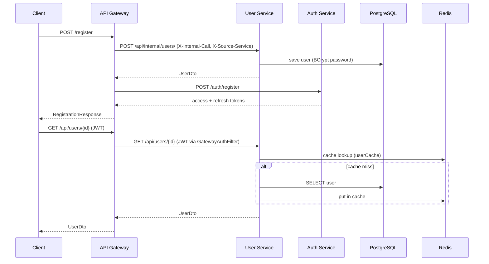
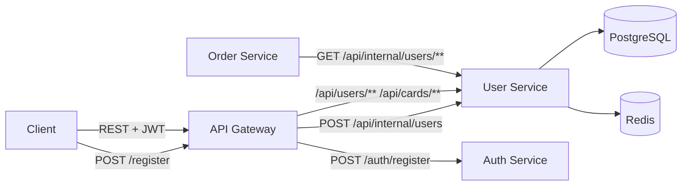

# User Service

Микросервис управления пользователями и платёжными картами в распределённой системе. Сервис хранит профили пользователей и привязанные к ним карты в PostgreSQL, кэширует часто запрашиваемые данные в Redis и предоставляет REST API для чтения и управления. Создание пользователя при регистрации инициирует **API Gateway** (оркестрация User Service + Auth Service); публичные запросы к `/api/users/**` и `/api/cards/**` также проходят через Gateway с JWT-аутентификацией.

---

## Содержание

- [Назначение](#назначение)
- [Архитектура](#архитектура)
- [Паттерны](#паттерны)
- [Технологический стек](#технологический-стек)
- [Потоки данных](#потоки-данных)
- [REST API](#rest-api)
- [Хранилища данных](#хранилища-данных)
- [Кэширование](#кэширование)
- [Безопасность](#безопасность)
- [Профили и конфигурация](#профили-и-конфигурация)
- [Запуск](#запуск)
- [Тестирование](#тестирование)
- [Структура проекта](#структура-проекта)
- [Интеграция с другими сервисами](#интеграция-с-другими-сервисами)

---

## Назначение

User Service выполняет следующие задачи:

1. **Управление пользователями** — CRUD-операции над профилями (имя, email, роль, пароль).
2. **Управление картами** — CRUD-операции над платёжными картами, привязанными к пользователям.
3. **Поиск и фильтрация** — по email, ID, роли, дате рождения, номеру карты, сроку действия.
4. **Внутренний API** — создание/удаление пользователей для Gateway и других сервисов через `/api/internal/users`.
5. **Кэширование** — Redis-кэш для `getUserById` и `getCardInfoById` с TTL 15 минут.

---

## Архитектура



> Заголовки `X-Internal-Call: true` и `X-Source-Service` Gateway добавляет автоматически ко всем исходящим WebClient-запросам (`WebClientConfig.mdcContextFilter`), в том числе к User Service и Auth Service.

Сервис использует **два хранилища**:

| Хранилище | Назначение |
|-----------|------------|
| **PostgreSQL** | Пользователи (`users`) и карты (`card_info`) |
| **Redis** | Declarative cache (`userCache`, `cardInfoCache`) |

---

## Паттерны

| Паттерн | Где используется | Описание |
|---------|------------------|----------|
| **Repository** | `UserRepository`, `CardInfoRepository` | Spring Data JPA — абстракция доступа к данным |
| **DTO Mapping** | MapStruct (`UserMapper`, `CardInfoMapper`) | Преобразование Entity ↔ DTO |
| **Declarative Cache** | `@Cacheable`, `@CachePut`, `@CacheEvict` | Redis-кэш с аннотациями Spring Cache |
| **Gateway Auth** | `GatewayAuthFilter` | JWT-парсинг для запросов от API Gateway |
| **Internal API** | `InternalController` | Service-to-service вызовы с заголовком `X-Internal-Call` |
| **Global Exception Handling** | `GlobalAdvice` + `@GlobalExceptionHandler` | Единый формат ошибок (`ErrorItem`) |
| **Profile-based Config** | `application-dev.properties` / `application-prod.properties` | Разные настройки для локальной разработки и Docker |

---

## Технологический стек

| Категория        | Технология |
|------------------|------------|
| Язык             | Java 21 |
| Framework        | Spring Boot 3.3.4 |
| SQL БД           | PostgreSQL 42.7 + Spring Data JPA |
| Кэш              | Redis 7 + Spring Cache (Lettuce) |
| Миграции         | Liquibase |
| Маппинг          | MapStruct 1.6 |
| Безопасность     | Spring Security + BCrypt + Gateway JWT Filter |
| Документация API | SpringDoc OpenAPI 3 |
| Метрики          | Micrometer + Prometheus (Actuator) |
| Логирование      | Logback + Logstash JSON Encoder |
| Общие библиотеки | `common-filters-spring-boot-starter` (GitHub Packages) |
| Контейнеризация  | Docker (multi-stage build) |
| Тесты            | JUnit 5, Mockito, Testcontainers |

---

## Потоки данных

### Регистрация пользователя (Gateway → User → Auth)

1. Клиент отправляет `POST /register` на **API Gateway** (`RegistrationController`).
2. Gateway вызывает `UserServiceWebClient.createUser()` → `POST /api/internal/users/` на User Service.
3. WebClient Gateway автоматически добавляет заголовки `X-Internal-Call: true` и `X-Source-Service`.
4. `InternalController` проверяет `X-Internal-Call`, делегирует в `UserService.createUser()`, пароль хешируется BCrypt, пользователь сохраняется в PostgreSQL.
5. Gateway вызывает `AuthServiceWebClient.register()` → `POST /auth/register` на Auth Service (создание credentials и выдача токенов).
6. При ошибке Auth Service Gateway выполняет rollback: `DELETE /api/internal/users/{id}`.

> **Auth Service не вызывает User Service.** Он только принимает регистрацию credentials после того, как Gateway уже создал профиль пользователя.

### Чтение пользователя (Gateway → User)

1. API Gateway проксирует запрос с JWT в заголовке `Authorization: Bearer ...` и служебными заголовками (`X-Internal-Call`, `X-Source-Service`).
2. `GatewayAuthFilter` парсит JWT payload и устанавливает `SecurityContext`.
3. `UserController` вызывает `UserService`, который проверяет Redis-кэш перед обращением к БД.

### Управление картами

1. `CardInfoController` принимает REST-запросы на `/api/cards/**`.
2. `CardInfoService` связывает карту с пользователем через `userId`, валидирует DTO (`@Valid`).
3. Результаты кэшируются в `cardInfoCache`.

---

## REST API

### Пользователи — `/api/users`

| Метод | Путь | Описание | Авторизация |
|-------|------|----------|-------------|
| `GET` | `/hello` | Приветствие аутентифицированного пользователя | Authenticated |
| `GET` | `/{id}` | Получить пользователя по ID | Authenticated |
| `GET` | `/find-by-email?email=` | Найти по email | Authenticated |
| `GET` | `/find-by-ids?ids=1&ids=2` | Найти по списку ID | Authenticated |
| `GET` | `/find-by-role?role=USER` | Найти по роли | Authenticated |
| `GET` | `/born-after?date=` | Родившиеся после даты | Authenticated |
| `GET` | `/all` | Все пользователи | Authenticated |
| `GET` | `/paginated?page=&size=` | Пагинация (native SQL) | Authenticated |
| `PUT` | `/{id}` | Обновить пользователя | Authenticated |
| `DELETE` | `/{id}` | Удалить пользователя | `ROLE_ADMIN` |

> Создание пользователей через публичный API недоступно — только через Internal API.

### Внутренний API — `/api/internal/users`

| Метод | Путь | Описание |
|-------|------|----------|
| `POST` | `/` | Создать пользователя |
| `GET` | `/{id}` | Получить по ID |
| `GET` | `/find-by-email?email=` | Получить по email |
| `DELETE` | `/{id}` | Удалить пользователя |

Все эндпоинты требуют заголовок `X-Internal-Call: true`.

### Карты — `/api/cards`

| Метод | Путь | Описание |
|-------|------|----------|
| `GET` | `/{id}` | Получить карту по ID |
| `GET` | `/find-by-number?number=` | Найти по номеру |
| `GET` | `/find-by-ids?ids=` | Найти по списку ID |
| `GET` | `/user/{user_id}` | Карты пользователя |
| `GET` | `/expired` | Просроченные карты |
| `GET` | `/all` | Все карты |
| `GET` | `/paginated?page=&size=` | Пагинация |
| `POST` | `/add` | Создать карту |
| `PUT` | `/{id}` | Обновить карту |
| `DELETE` | `/{id}` | Удалить карту |

Swagger UI (агрегированный, через Gateway): `http://localhost:8080/swagger-ui.html`

> User Service API docs доступны в Gateway UI как **User Service** (`/api/users/v3/api-docs`). При прямом запуске сервиса без Gateway: `http://localhost:8083/swagger-ui.html`.

---

## Хранилища данных

### PostgreSQL — таблица `users`

| Поле | Тип | Описание |
|------|-----|----------|
| `id` | bigint (PK) | Идентификатор |
| `name` | varchar | Имя |
| `surname` | varchar | Фамилия |
| `birth_date` | date | Дата рождения |
| `email` | varchar (unique) | Email |
| `password` | varchar | BCrypt-хеш пароля |
| `role` | varchar | `USER` / `ADMIN` |

### PostgreSQL — таблица `card_info`

| Поле | Тип | Описание |
|------|-----|----------|
| `id` | bigint (PK) | Идентификатор |
| `number` | varchar(16) | Номер карты |
| `holder` | varchar | Держатель |
| `expiration_date` | date | Срок действия |
| `user_id` | bigint (FK) | Ссылка на `users.id` |

Миграции управляются Liquibase: `db/changelog/` (v1.0 — таблицы, v2.0 — seed-данные, v3.0 — индексы).

---

## Кэширование

| Кэш | Ключ | TTL | Операции |
|-----|------|-----|----------|
| `userCache` | `userId` | 15 мин | `@Cacheable` (read), `@CachePut` (update), `@CacheEvict` (delete) |
| `cardInfoCache` | `cardId` | 15 мин | `@Cacheable` (read), `@CachePut` (update), `@CacheEvict` (delete) |

Сериализация: `GenericJackson2JsonRedisSerializer` с `JavaTimeModule` и default typing для корректной десериализации DTO.

---

## Безопасность

- **Spring Security** — все `/api/**` (кроме internal) требуют аутентификации.
- **GatewayAuthFilter** — для запросов от Gateway парсит JWT из `Authorization: Bearer` и устанавливает `SecurityContext` с ролями.
- **Internal API** — `/api/internal/**` доступен без JWT, но контроллер проверяет `X-Internal-Call: true`.
- **Service-to-service** — запросы без заголовков Gateway проходят без аутентификации (для прямых вызовов между сервисами).
- **Пароли** — BCrypt-хеширование при создании; `@JsonProperty(WRITE_ONLY)` скрывает пароль в JSON-ответах.
- **Публичные эндпоинты** — `/actuator/**`, Swagger UI.

---

## Профили и конфигурация

| Профиль | Файл | Назначение |
|---------|------|------------|
| default + `dev` | `application.properties` + `application-dev.properties` | Локальная разработка |
| `prod` | `application.properties` + `application-prod.properties` | Production (Docker) |
| `test` | `application-test.properties` (test scope) | Unit/Integration тесты |

Общие настройки (порт, OpenAPI, Actuator, JPA, Liquibase changelog, Redis port) вынесены в `application.properties`. Профильные файлы содержат только отличия: URL БД, credentials, Redis host, logging levels.

---

## Запуск

### Требования

- Java 21
- Maven 3.9+
- Docker (для PostgreSQL, Redis; для тестов — Testcontainers)
- GitHub Packages token (для `common-filters-starter`)

### Локально (dev)

```bash
# PostgreSQL и Redis — запустить локально или через docker-compose

mvn spring-boot:run -Dspring-boot.run.profiles=dev
```

### Docker

```bash
docker build \
  --build-arg GITHUB_TOKEN=<token> \
  --build-arg GITHUB_USERNAME=<username> \
  -t userservice .

docker run -p 8083:8083 \
  -e DB_HOST=postgres \
  -e DB_PORT=5432 \
  -e DB_NAME=userservicedb \
  -e DB_USER=postgres \
  -e DB_PASSWORD=<password> \
  userservice
```

Профиль `prod` активируется автоматически в Dockerfile.

---

## Тестирование

```bash
mvn test
```

### Структура тестов

```
src/test/java/com/mymicroservice/userservice/
├── configuration/          # TestContainersConfig
├── integration/
│   ├── service/            # UserServiceImplIT, CardInfoServiceImplIT
│   ├── repository/         # UserRepositoryTest, CardInfoRepositoryTest
│   └── UserServiceApplicationTests.java
├── unit/
│   ├── service/            # UserServiceImplTest, CardInfoServiceImplTest
│   ├── mapper/             # UserMapperTest, CardInfoMapperTest
│   └── controller/         # UserControllerTest, CardInfoControllerTest, InternalControllerTest
└── util/
    ├── data/               # TestConstants
    ├── UserGenerator, UserDtoGenerator
    └── CardInfoGenerator, CardInfoDtoGenerator
```

### Типы тестов

| Класс | Тип | Инфраструктура |
|-------|-----|----------------|
| `UserServiceImplTest` | Unit (Mockito) | Моки репозитория и PasswordEncoder |
| `CardInfoServiceImplTest` | Unit (Mockito) | Моки репозиториев |
| `UserControllerTest` | Web (@WebMvcTest) | MockMvc + mock UserService |
| `UserRepositoryTest` | Data (@DataJpaTest) | Testcontainers PostgreSQL |
| `UserServiceImplIT` | Integration (@SpringBootTest) | Testcontainers PostgreSQL + Redis |
| `*MapperTest` | Unit | MapStruct маппинг |

### Генераторы тестовых данных

| Класс | Назначение |
|-------|------------|
| `UserGenerator` | Entity `User` |
| `UserDtoGenerator` | DTO `UserDto` |
| `CardInfoGenerator` | Entity `CardInfo` |
| `CardInfoDtoGenerator` | DTO `CardInfoDto` |
| `TestConstants` | Все константы для тестов |

### Стиль именования тестов

```
<имяМетода>_Should<Ожидание>_When<Условие>
```

Пример: `createUser_ShouldSaveUserToDatabase_WhenDtoIsValid`

---

## Интеграция с другими сервисами



| Сервис | Направление | Протокол | Контракт |
|--------|-------------|----------|----------|
| API Gateway | → User Service | `POST/DELETE /api/internal/users/**` (WebClient) | `UserDto` + `X-Internal-Call`, `X-Source-Service` |
| API Gateway | → User Service | REST `/api/users/**`, `/api/cards/**` (route proxy) | JWT via `GatewayAuthFilter` |
| API Gateway | → Auth Service | `POST /auth/register`, `DELETE /api/internal/auth/user/{id}` | tokens / cascade delete |
| Order Service | → User Service | Feign `GET /api/internal/users/**` | `UserDto` + `X-Internal-Call: true` |

---

## Лицензия

Учебный / демонстрационный проект @juliakaiko.
